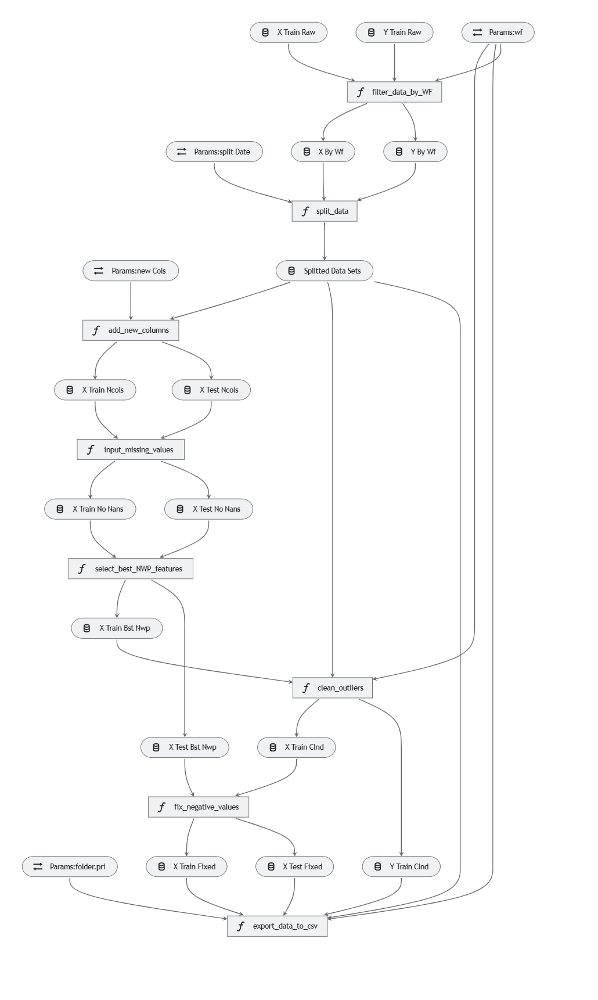

# **Wind Power Forecasting – Application Tool**

This repository contains the source code for my **Final Master's degree project** in [Decision Systems Engineering](https://www.urjc.es/estudios/master/915-ingenieria-de-sistemas-de-decision) at [Rey Juan Carlos University](https://www.urjc.es/). The project focuses on *Wind Power Forecasting using Machine Learning techniques* and was developed as part of the [Data Science Challenge](https://challengedata.ens.fr/participants/challenges/34/) organized by *Compagnie nationale du Rhône (CNR)*.

For a detailed explanation, you can read the full **master’s thesis [here](thesis.pdf)**.

---

## **Project Overview**

This tool is designed to be a **flexible and configurable application** for building, analyzing, and deploying ML models for wind power forecasting. The project applies **software engineering best practices** to ML pipelines using:

* **[Kedro](https://kedro.readthedocs.io/en/stable/index.html)** – for structuring data and ML pipelines
* **[MLflow](https://mlflow.org/)** – for experiment tracking, including code, data, parameters, and results

Key objectives:

* Create reproducible ML pipelines for wind power prediction
* Enable configurable, parameter-driven experimentation
* Provide tools for **visualization, monitoring, and deployment**

---

## **Implemented Pipelines**

1. **EDA (`eda`)** – Prepare raw data for Exploratory Data Analysis
2. **Data Engineering (`de`)** – Process raw data for ML consumption
3. **Feature Engineering (`fe`)** – Explore and generate new features for improved modeling
4. **Modeling (`mdl`)** – Train selected algorithms (MARS, KNN, Random Forest, SVM), optimize hyperparameters, and make predictions

Additional pipelines:

* **CNR pipeline** – Includes subpipelines for challenge-specific predictions and submission file generation
* **Neural Networks** – Work in progress

---

## **Configuration**

Each pipeline uses **configuration files**:

* `parameters.yml` – Pipeline-specific parameters
* `catalog.yml` – Registry of all datasets and data sources

Located in: `conf/base`

These files allow full control over:

* Dataset selection
* Algorithm choice
* Pipeline parameters (e.g., number of features for feature selection)

---

## **Getting Started**

**Install dependencies:**

```bash
conda create --name wind_forecast python=3.9
conda activate wind_forecast
pip install -r requirements.txt
```

**Place raw data** in: `data/01_raw/`
Raw data available [here](https://challengedata.ens.fr/challenges/34) (requires free registration).

**Run pipelines using Kedro CLI:**

```bash
# Prepare data for EDA
kedro run --pipeline eda --params wf:WF1

# Data engineering
kedro run --pipeline de --params wf:WF1

# Feature engineering
kedro run --pipeline fe --params wf:WF1,max_k_bests:3

# Modeling (example using KNN)
kedro run --pipeline mdl --params wf:WF1,alg:KNN
```

**Notes:**

* All parameters in `parameters.yml` can be overridden via CLI
* Data catalog can be customized for alternative datasets

---

## **Pipeline Visualization**

Visualize Kedro pipelines using `kedro-viz`:

```bash
kedro viz
```

Example: Data Engineering pipeline visualization:

  

---

## **Additional Tools**

* **MLflow Tracking UI:**

```bash
kedro mlflow ui
```

Serve experiment tracking locally at `localhost:5000`

* **Jupyter Notebook with Kedro context:**

```bash
kedro jupyter notebook
```

Access pipelines, data catalogs, parameters, and all project variables.

---


**Key Technologies:**
Python | Kedro | MLflow | MARS | KNN | Random Forest | SVM | Pipeline Automation | Feature Engineering | Wind Power Forecasting